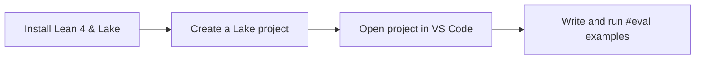
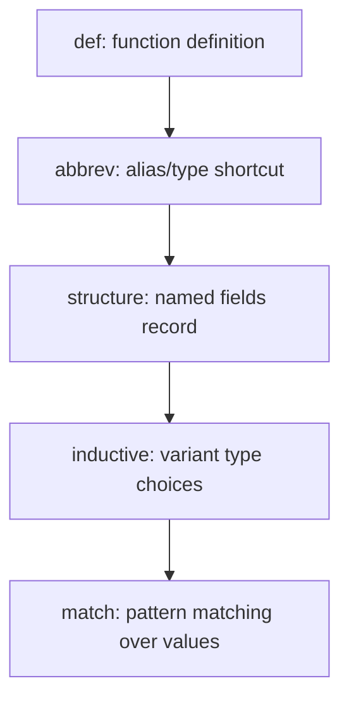
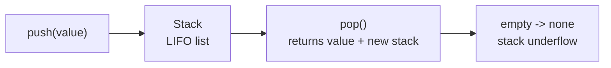
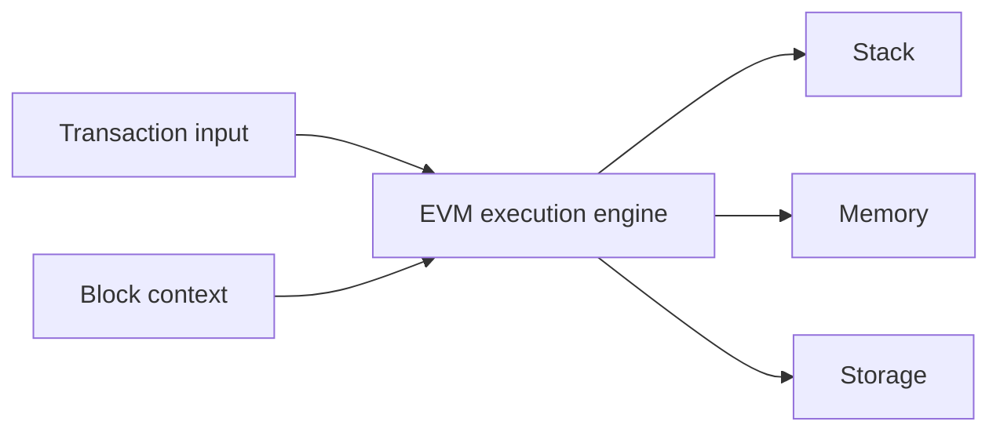
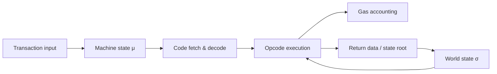
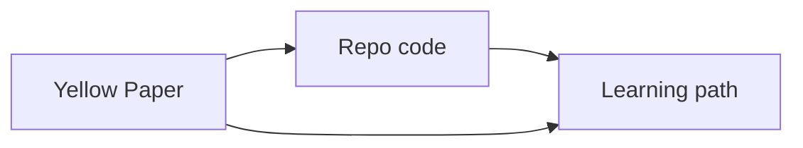
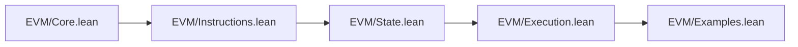
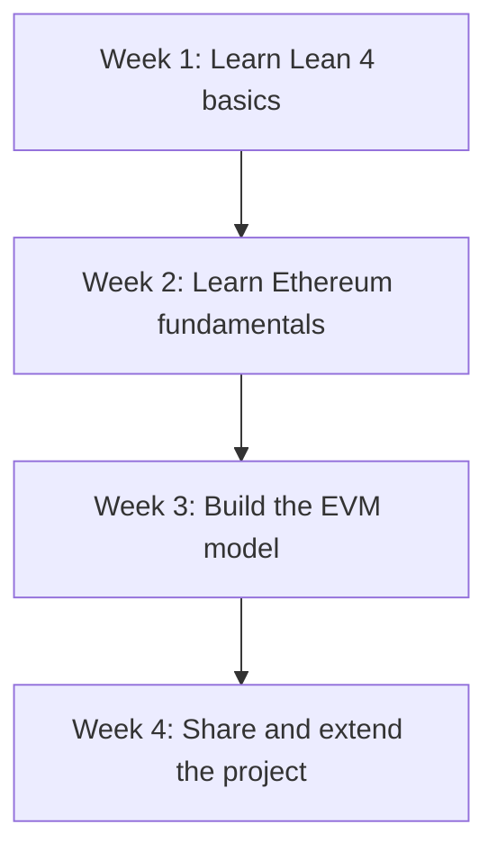

# Lean 4 + Ethereum EVM Learning Path

This document is a step-by-step path for anyone learning Lean 4 and Ethereum’s EVM. It is written for people with little or no math background, with plain-language explanations and practical tasks.

## How to use this guide
- Read one section at a time.
- Run the code examples in Lean.
- If you see a word you do not know, keep moving and come back to it later.
- The Ethereum Yellow Paper is used as a reference. You do not need to understand every formula to follow this guide.

## 1. Lean 4 Basics for Beginners

### 1.1 Install and Set Up
1. Open your terminal.
2. Install Lean 4 and Lake by following the official quickstart guide:
   https://leanprover.github.io/lean4/doc/quickstart.html
3. Check that the tools work:
   - `lake --version`
   - `lake env lean --version`
4. Create a new project:
   - `lake init my-project`
5. Open the folder in VS Code.
6. Install the Lean extension in VS Code if it is not already installed.



### 1.2 First Lean 4 Concepts
These are the smallest pieces of Lean that you need first.

- `def` means "define a function." Example:
  ```lean
  def add (x y : Nat) : Nat := x + y
  ```
  This means "add two numbers."

- `abbrev` means "short name." Example:
  ```lean
  abbrev Name := String
  ```

- `structure` means "a record with named fields." Example:
  ```lean
  structure Person where
    name : String
    age : Nat
  ```

- `inductive` means "a type with a few fixed choices." Example:
  ```lean
  inductive Color : Type where
    | red
    | green
    | blue
  ```

- `match` means "check the shape of a value and do different things." Example:
  ```lean
  def describeColor (c : Color) : String :=
    match c with
    | Color.red => "red"
    | Color.green => "green"
    | Color.blue => "blue"
  ```



### 1.3 Run small examples
1. Create a file, for example `example.lean`.
2. Add this code:
   ```lean
   def add (x y : Nat) : Nat := x + y
   #eval add 2 3
   ```
3. Save and open the file in VS Code.
4. Use `#eval` to run the example inside the editor.

### 1.4 Learn about lists and options
These are very common in Lean.

- `List` is a sequence of items.
  ```lean
  def numbers : List Nat := [1, 2, 3]
  ```

- `Option` means a value may or may not exist.
  ```lean
  def safeDiv (x y : Nat) : Option Nat :=
    if y = 0 then
      none
    else
      some (x / y)
  ```

- `some` means a value exists.
- `none` means no value.

### 1.5 Write a simple stack example
A stack is like a stack of plates: last item in, first item out.

1. Define a stack type:
   ```lean
   structure Stack where
     items : List Nat
   ```
2. Write `push` and `pop`:
   ```lean
   def push (s : Stack) (x : Nat) : Stack :=
     { s with items := x :: s.items }

   def pop (s : Stack) : Option (Nat × Stack) :=
     match s.items with
     | [] => none
     | x :: xs => some (x, { s with items := xs })
   ```
3. Try it with `#eval`.



### 1.6 Understand immutability and pure functions
- In Lean, variables do not change once created.
- Functions return new values instead of changing old ones.
- This makes code easier to understand.

Example:
```lean
let s1 := Stack.mk [1, 2]
let s2 := push s1 3
```
After this, `s1` still has `[1, 2]` and `s2` has `[3, 1, 2]`.

## 2. Learn Ethereum and the EVM with No Math

### 2.1 Ethereum without formulas
Think of Ethereum like a world computer.

- An **account** is like a user or a wallet address.
- A **transaction** is like sending a message that also moves value.
- **Gas** is the fee you pay for each step of the computation.
- A **block** is a batch of transactions.
- A **contract** is a small program on the blockchain.
- **Storage** is permanent information saved by a contract.

### 2.2 EVM in plain English
The EVM is the machine that runs contract code.

- The **stack** is a short-term list of values. Use it like temporary workspace.
- The **memory** is a temporary scratchpad. It resets when execution ends.
- The **storage** is a long-term filing cabinet for contract state.
- An **opcode** is one instruction the EVM can run.





Use these mental images:
- Stack = stack of plates
- Memory = whiteboard
- Storage = filing cabinet
- Gas = fuel for the machine

### 2.3 Read the Yellow Paper without math
The Yellow Paper is the formal definition of Ethereum. You can use it as a reference rather than reading it front to back.

#### How to start:
1. Open the Yellow Paper: https://ethereum.github.io/yellowpaper/paper.pdf
2. Read the introduction and overview.
3. Ignore heavy equations at first. Focus on the words.
4. Find these sections by number or keywords:
   - the EVM execution model
   - stack, memory, storage
   - gas and transaction execution
5. Use the repo code to translate Yellow Paper ideas into simple Lean code.



#### Helpful mapping:
- `σ` in the Yellow Paper is the global state (storage data across accounts).
- `μ` is the machine state (stack, memory, program counter, gas).
- `PC` is the program counter, the current instruction number.
- `push`, `pop`, `jump` are described in words and with small tables.

For a complete Yellow Paper structure mapped into Mermaid, see:
- [YELLOW_PAPER_MERMAID.md](YELLOW_PAPER_MERMAID.md)

### 2.4 Learn opcode meaning step by step
Do one opcode at a time.

1. Start with `PUSH`: it puts a number on the stack.
2. Learn `ADD`: it takes two numbers from the stack and returns their sum.
3. Learn `MLOAD`: it reads a value from memory.
4. Learn `SSTORE`: it saves a value into storage.
5. Learn `JUMP` and `JUMPI`: they change where execution goes.

### 2.5 Ethereum basics to practice
Follow these simple tasks:
- Find an article that explains Ethereum gas in plain words.
- Watch a short video on the EVM stack machine.
- Draw the path of a simple transaction: account → contract → state change.

## 3. Learn by reading this repository

### 3.1 Start with the easiest files
Open the files in this order and do not worry about every detail at first.

1. `EVM/Core.lean`
   - See how `Word256`, `Stack`, `Memory`, and `Storage` are defined.
   - Notice that `Stack` is just a list and `Memory` is a list of words.

2. `EVM/Instructions.lean`
   - Read the list of opcodes.
   - Each opcode is one case in the instruction type.

3. `EVM/State.lean`
   - Look at the execution state record.
   - See `stack`, `memory`, `storage`, `pc`, `gas`, and `code`.

4. `EVM/Execution.lean`
   - This is the interpreter.
   - Each instruction has one `match` case.

5. `EVM/Examples.lean`
   - Run the real examples.
   - See how the model behaves.



### 3.2 Task-based reading
Do these tasks one by one.

#### Task 1: Find `Stack.push`
- Open `EVM/Core.lean`.
- Search for `def Stack.push`.
- Read how it checks stack size and adds a new value.

#### Task 2: Find `Instruction.push`
- Open `EVM/Instructions.lean`.
- Find the `push` constructor.
- Notice it stores a value inside the instruction.

#### Task 3: Find `Instruction.add`
- Open `EVM/Execution.lean`.
- Read the `Instruction.add` case.
- See how it pops two values and pushes the sum.

#### Task 4: Run an example
- Open `EVM/Examples.lean`.
- Use `#eval` to run `example_add`.
- Verify the result is correct.

#### Task 5: Add a new opcode
- Pick a simple operation, like `Instruction.lt` or `Instruction.not`.
- Add the instruction case in `EVM/Execution.lean` by copying the style of `Instruction.add`.
- Run a small example to verify it works.

### 3.3 Use the Yellow Paper side-by-side
As you read the repo:
- Each time you see `stack`, `memory`, or `storage`, open the Yellow Paper and find the matching description.
- When you see `ExecutionState`, think of the Yellow Paper’s `μ` machine state.
- When you see `sload` or `sstore`, think of the Yellow Paper’s `σ` world state.

## 4. Step-by-step learning schedule
This schedule is designed for beginners and does not require math experience.



### Week 1: Learn Lean 4 from scratch
- **Day 1:** Install Lean and Lake, create a project.
- **Day 2:** Learn `def`, `structure`, and `inductive`.
- **Day 3:** Practice `match` and `List`.
- **Day 4:** Learn `Option` and `do` notation.
- **Day 5:** Write a simple stack example and run it.
- **Day 6:** Read the code in `EVM/Core.lean`.
- **Day 7:** Review the Lean concepts with small examples.

### Week 2: Learn Ethereum fundamentals
- **Day 1:** Learn what accounts, transactions, and gas are.
- **Day 2:** Learn what contracts and storage are.
- **Day 3:** Read the Yellow Paper introduction and terms.
- **Day 4:** Draw the EVM stack, memory, and storage on paper.
- **Day 5:** Study one opcode per day: `PUSH`, `ADD`, `MLOAD`, `SSTORE`, `JUMP`.
- **Day 6:** Compare the Yellow Paper words with the repo code.
- **Day 7:** Summarize the EVM in your own words.

### Week 3: Build the EVM model in Lean 4
- **Day 1:** Read `EVM/Instructions.lean` and `EVM/State.lean`.
- **Day 2:** Read `EVM/Execution.lean` and understand one instruction.
- **Day 3:** Run examples in `EVM/Examples.lean`.
- **Day 4:** Add one new instruction to the model.
- **Day 5:** Add one new example and run it.
- **Day 6:** Read `DESIGN.md` for the why behind the code.
- **Day 7:** Use `QUICKREF.lean` to plan another feature.

### Week 4: Make it real and share it
- **Day 1:** Add gas accounting or another real EVM feature.
- **Day 2:** Add a test or an example program.
- **Day 3:** Read the Yellow Paper sections for execution and gas.
- **Day 4:** Write a short summary of what you built.
- **Day 5:** Create a blog or LinkedIn post using the sample text below.
- **Day 6:** Share the repo and ask for feedback.
- **Day 7:** Review and plan the next extension.

## 5. Yellow Paper reading path
This is a gentle way to use the Yellow Paper.

### Step 1: Read the introduction
- Focus on the words, not equations.
- Understand that Ethereum is a state machine.
- Look for the words "machine state," "world state," and "gas."

### Step 2: Read EVM sections slowly
- Find where the paper defines the EVM.
- Read the English explanations of stack, memory, and storage.
- Do not worry if equations look complex.

### Step 3: Use the repo to make it concrete
- When the paper says "stack," open `EVM/Core.lean`.
- When the paper says "memory," open `EVM/Core.lean` again.
- When the paper says "machine state," open `EVM/State.lean`.

### Step 4: Learn by example
- Pick one opcode from the paper.
- Find its matching code in `EVM/Execution.lean`.
- Run an example with that opcode.

### Step 5: Keep the Yellow Paper as a reference
- Use it when you want to understand exact EVM definitions.
- Use this repo when you want to see working code.

## 6. LinkedIn post

**Title:** Learning Lean 4 by modeling the Ethereum EVM

**Post:**

> I’m building a beginner-friendly path to learn Lean 4 and Ethereum’s EVM together.
>
> This project shows how to model EVM instructions in Lean with:
> - simple stack, memory, and storage structures
> - clear `inductive` opcode definitions
> - pattern matching in the interpreter
> - a practical connection to the Ethereum Yellow Paper
>
> If you want to learn formal methods without getting lost in math, this guide makes it easier.
> See the repo: https://github.com/deepakraous/evm-lean4
>
> #Lean4 #Ethereum #EVM #FormalMethods #Blockchain #SmartContracts

## 7. How to use this learning path
- Use the schedule as a checklist.
- Do the code tasks, not just read the words.
- Keep the Yellow Paper as a reference, not the only source.
- Ask questions on forums or in the Lean community if you get stuck.

---

## Notes
- This path is built for learners with little math experience.
- Concrete examples and analogies are the main focus.
- The repo is a practical workspace for exploring EVM behavior in Lean 4.
