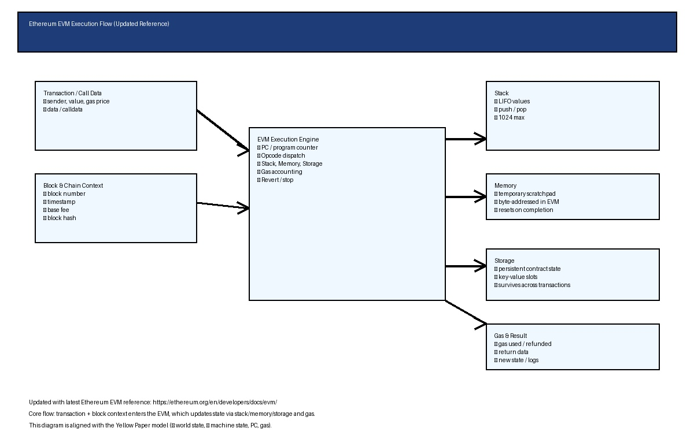

# EVM Model in Lean 4

A **minimal, educational implementation** of the Ethereum Virtual Machine (EVM) written in pure Lean 4. This model focuses on clarity and correctness while covering the essential components of bytecode execution.

## Architecture Overview

```
EVM Model
├── Core.lean          → Fundamental types (Word256, Stack, Memory, Storage)
├── Instructions.lean  → Instruction set (Opcodes)
├── State.lean         → Execution state and context
├── Execution.lean     → Interpreter and execution engine
└── Examples.lean      → Concrete usage examples
```

## Ethereum EVM Execution Flow

A high-level view of how the EVM processes transaction input and block context, manages stack/memory/storage, consumes gas, and updates the world state.



The diagram reflects the latest Ethereum EVM reference and the Yellow Paper model for machine state and world state.

## Core Components

### 1. **Core Types** (`EVM/Core.lean`)

#### `Word256`: 256-bit values
- Represented as `Nat` with automatic wrapping to 2^256
- Used for stack values, memory cells, and storage slots

```lean
abbrev Word256 := Nat
def toWord256 (n : Nat) : Word256 := n % (2^256)
```

**Why this design**: Direct representation allows us to use Lean's existing arithmetic. Modular arithmetic ensures all values stay in valid range.

#### `Stack`: LIFO data structure
- Maximum 1024 items, each 256 bits
- Operations: `push`, `pop`, `peek`, `depth`
- Returns `Option` types to handle underflow/overflow

```lean
structure Stack where
  items : List Word256

def Stack.push (s : Stack) (v : Word256) : Option Stack :=
  if s.items.length < 1024 then some ⟨v :: s.items⟩ else none
```

**Why List**: Simple, immutable, enables functional semantics. Each operation creates a new stack.

#### `Memory`: Byte-addressable storage
- Indexed by 32-byte word addresses
- Stores 256-bit values at each address
- Returns 0 for unwritten addresses

```lean
def Memory.read (m : Memory) (addr : Word256) : Word256 :=
  if addr < m.cells.length then m.cells.get! addr else 0
```

**Why this approach**: Word-addressed (not byte-addressed) for simplicity while maintaining EVM semantics.

#### `Storage`: Persistent key-value store
- Maps 256-bit keys to 256-bit values
- Per-contract persistent state
- Omits zero values (gas optimization)

```lean
def Storage.write (st : Storage) (key : Word256) (v : Word256) : Storage :=
  let slots := st.slots.filter (fun (k, _) => k ≠ key)
  if v = 0 then ⟨slots⟩ else ⟨slots ++ [(key, v)]⟩
```

---

### 2. **Instructions** (`EVM/Instructions.lean`)

Using Lean 4's `inductive` type with explicit constructors:

```lean
inductive Instruction : Type where
  | stop : Instruction
  | add : Instruction
  | push (v : Word256) : Instruction
  | ...
```

**Instruction Categories**:
- **Arithmetic**: `add`, `mul`, `sub`, `div`, `mod`
- **Comparison**: `lt`, `gt`, `eq`, `slt`, `sgt`
- **Bitwise**: `and`, `or`, `xor`, `not`
- **Stack**: `pop`, `dup n`, `swap n`
- **Memory**: `mload`, `mstore`, `msize`
- **Storage**: `sload`, `sstore`
- **Control Flow**: `push`, `jump`, `jumpi`, `jumpdest`, `ret`, `revert`

---

### 3. **Execution State** (`EVM/State.lean`)

```lean
structure ExecutionState where
  stack : Stack
  memory : Memory
  storage : Storage
  pc : Nat              -- program counter
  gas : Gas             -- remaining gas
  code : List Instruction
```

**Helper functions**:
- `currentInstruction`: Fetch instruction at PC
- `nextPc`: Increment program counter
- `jump`: Jump to address
- `deductGas`: Track gas consumption

---

### 4. **Execution Engine** (`EVM/Execution.lean`)

The core interpreter uses `match` statements (pure Lean 4 syntax) for instruction dispatch:

```lean
def executeInstruction (instr : Instruction) (state : ExecutionState) :
    Option (ExecutionResult × ExecutionState) := do
  match instr with
  | Instruction.add =>
      let s ← state.stack.pop         -- Pop b
      let (b, s') ← Stack.pop s.2     -- Pop a
      let (a, s'') ← Stack.pop s'.2
      let sum := toWord256 (a + b)
      let s''' ← s''.push sum
      pure (ExecutionResult.ok, { state with stack := s''' })
  | Instruction.push v =>
      let s ← state.stack.push v
      pure (ExecutionResult.ok, { state with stack := s })
  | ...
```

**Key design decisions**:
- Using `Option` for error handling (no exceptions)
- `do` notation (monadic syntax) for clean sequential code
- Direct immutable updates with struct `{ state with ... }` syntax

**Execution loop** (`execute` function):
```lean
def execute (bytecode : List Instruction) (gas : Gas) (fuel : Nat) :
    ExecutionResult × ExecutionState := 
  let rec loop (state : ExecutionState) (fuel : Nat) :=
    match fuel with
    | 0 => (ExecutionResult.outOfGas, state)
    | fuel + 1 =>
        match ExecutionState.currentInstruction state with
        | some instr =>
            match executeInstruction instr state with
            | some (ExecutionResult.ok, state') => 
                loop (state'.nextPc) fuel
            | some (result, state') => (result, state')
```

- **Fuel parameter**: Prevents infinite loops (safety mechanism)
- Returns: `ExecutionResult` (status) and final `ExecutionState`

---

## Why Lean 4 Syntax

### ✅ Avoid Lean 3 constructs:

| Lean 3 ❌ | Lean 4 ✅ |
|-----------|----------|
| `variables (x : Nat)` | Direct `def` and struct params |
| `begin...end` | `match` statements, `do` blocks |
| `inductive` (implicit) | `inductive Instruction : Type where \| constructor : Inductive` |
| `@[simp]` lemmas | Explicit `match` expressions |

### ✅ Pure Lean 4 advantages:

1. **`inductive` with explicit constructors**: Clear, type-safe instruction representation
2. **`match` statements**: Direct pattern matching for instruction execution
3. **Monadic `do` notation**: Elegant error handling with `Option`
4. **Struct updates**: `{ state with stack := ... }` (immutable)
5. **Namespaces**: Organized module structure

---

## Usage Examples

### Simple Arithmetic
```lean
def example_add : List Instruction :=
  [Instruction.push 5, Instruction.push 3, Instruction.add, Instruction.stop]

#eval execute example_add 10000 1000
-- Result: (ok, state with stack = [8])
```

### Memory Operations
```lean
def example_memory : List Instruction :=
  [
    Instruction.push 42,
    Instruction.push 0,
    Instruction.mstore,
    Instruction.push 0,
    Instruction.mload,
    Instruction.stop
  ]
```

### Conditional Jump
```lean
def example_conditional : List Instruction :=
  [
    Instruction.push 5,     -- target address
    Instruction.push 1,     -- condition (true)
    Instruction.jumpi,      -- jump if condition != 0
    Instruction.push 100,   -- skipped
    Instruction.stop
  ]
```

---

## Design Philosophy

1. **Minimality**: Include only essential EVM components (no gas metering, no precompiles)
2. **Clarity**: Every operation explicitly shown; no implicit behavior
3. **Type Safety**: Use Lean's type system to prevent invalid states
4. **Immutability**: Pure functional semantics—no mutable state
5. **Testability**: Concrete examples demonstrate correctness

---

## Future Extensions

- **Signed arithmetic** (`sdiv`, `smod`, `slt`, `sgt`)
- **Advanced stack operations** (`dup 1-16`, `swap 1-16`)
- **Gas metering** with per-instruction costs
- **Calldata** and return data handling
- **Security proofs** (e.g., stack depth invariants)
- **Bytecode verification** properties

---

## Project Structure

```
evm-lean4/
├── lakefile.lean          -- Lake build configuration
├── EVM.lean               -- Main module (imports all submodules)
├── EVM/
│   ├── Core.lean          -- Word256, Stack, Memory, Storage
│   ├── Instructions.lean  -- Instruction set
│   ├── State.lean         -- Execution state
│   ├── Execution.lean     -- Interpreter
│   └── Examples.lean      -- Usage examples
└── README.md              -- This file
```

---

## Getting Started

To build and run the project (requires Lean 4 and Lake):

```bash
lake build
lake env lean EVM/Examples.lean
```

To explore in an editor:
- Open `EVM/Core.lean` to understand basic types
- Follow with `EVM/Instructions.lean` for the instruction set
- Study `EVM/Execution.lean` for the interpreter logic
- Check `EVM/Examples.lean` for practical usage

---

**License**: Educational use. Feel free to extend and modify!
