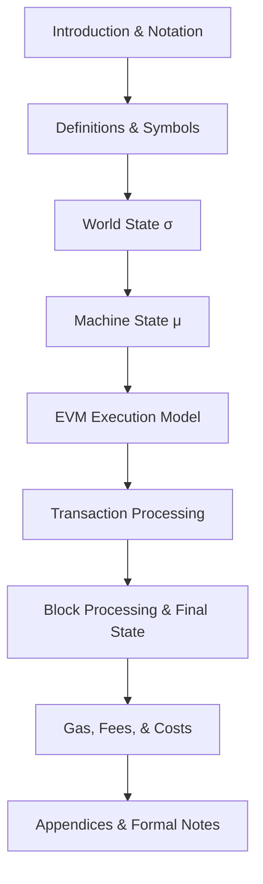
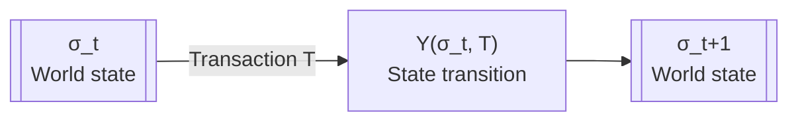
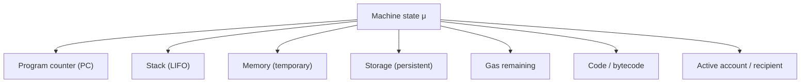
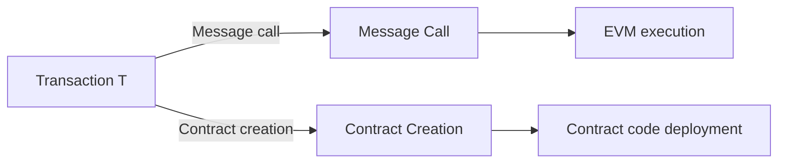
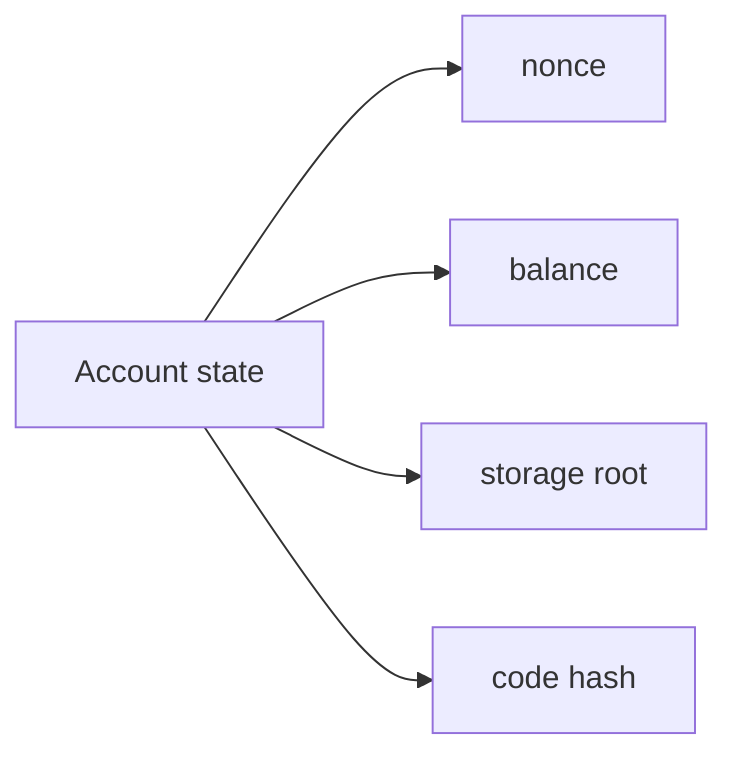
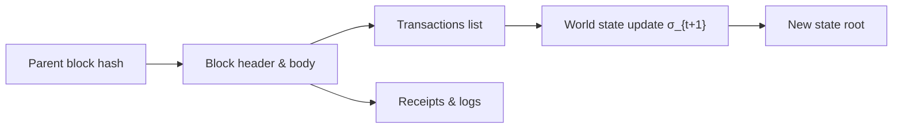
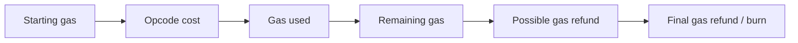

# Ethereum Yellow Paper Mermaid Reference

This file maps the core Ethereum Yellow Paper structure and EVM models into GitHub Mermaid diagrams.
It is a visual reference, not a verbatim reproduction. For the full formal specification, see:
https://ethereum.github.io/yellowpaper/paper.pdf

## 1. Yellow Paper structure map



## 2. Yellow Paper symbol reference table

| Symbol | Meaning | Notes |
|---|---|---|
| `σ` | World state | Maps addresses to account state |
| `μ` | Machine state | Execution context for the EVM |
| `Υ` | State transition function | `σ_{t+1} = Υ(σ_t, T)` |
| `T` | Transaction | Message call or contract creation |
| `H` | Block header | Contains metadata and roots |
| `B` | Block | Header plus body |
| `L` | Block gas limit | Maximum gas per block |
| `n` | Block number | Height of the block |
| `p` | Program counter (`PC`) | Instruction pointer |
| `g` | Gas remaining | Gas available during execution |
| `m` | Memory | Temporary byte-addressed machine memory |
| `s` | Stack | Last-in first-out evaluation stack |
| `S` | Storage | Persistent contract storage |
| `A` | Account | Addressable account state |
| `σ[a]` | Account state at address `a` | `(nonce, balance, storageRoot, codeHash)` |
| `I` | Execution environment | Includes origin, caller, value, input |
| `ω` | Block header values | Block-level parameters used by the EVM |
| `c` | Code / bytecode | Sequence of opcodes executed by the EVM |
| `v` | Value | Ether transferred by the transaction |
| `ρ` | Receipt | Execution outcome and logs |

## 3. Yellow Paper math and model explanation

The Yellow Paper defines Ethereum as a deterministic state machine. The main mathematical object is the state transition function:

```text
σ_{t+1} = Υ(σ_t, T)
```

- `σ_t` is the world state before the transaction.
- `T` is the transaction being processed.
- `Υ` computes the new world state after executing `T`.

The world state `σ` is a mapping from account addresses `a` to account state records:

```text
σ[a] = (nonce, balance, storageRoot, codeHash)
```

The machine state `μ` contains the EVM execution context:

```text
μ = (pc, gas, memory, stack, storage, code, address, origin, caller, value, input)
```

- `pc`: program counter within the code.
- `gas`: remaining gas for execution.
- `memory`: transient byte-addressable buffer.
- `stack`: last-in first-out stack used by opcodes.
- `storage`: contract storage visible to `SSTORE` / `SLOAD`.
- `code`: contract bytecode being executed.
- `address`: current executing account address.
- `origin`: original transaction sender.
- `caller`: immediate caller address.
- `value`: Wei sent with the call.
- `input`: calldata or init code for the current execution.

Gas accounting is expressed by subtracting instruction cost from remaining gas:

```text
g' = g - cost(opcode)
```

If the machine does not have enough gas, execution aborts with an out-of-gas condition.

The block header `H` contains fields used by state transition and gas calculations, for example:

```text
H = (parentHash, ommersHash, beneficiary, stateRoot, transactionsRoot, receiptsRoot,
     logsBloom, difficulty, number, gasLimit, gasUsed, timestamp, extraData, mixHash, nonce)
```

Transaction `T` fields include:

```text
T = (nonce, gasPrice, gasLimit, to, value, data, v, r, s)
```

The execution of `T` can be either a message call or contract creation. In both cases, the EVM uses `μ` and the environment `I` to step through opcodes and update `σ`.

## 4. State transition function



## 5. Machine state μ components



## 6. Transaction type classification



## 7. EVM execution lifecycle


## 6. Account state model



## 7. Block processing overview



## 8. Gas accounting summary



## 9. How to read this reference

- Use this file to map key Yellow Paper models into diagrams.
- Each Mermaid graph is a visual summary of core Yellow Paper concepts.
- For formal definitions, consult the official Yellow Paper directly.
