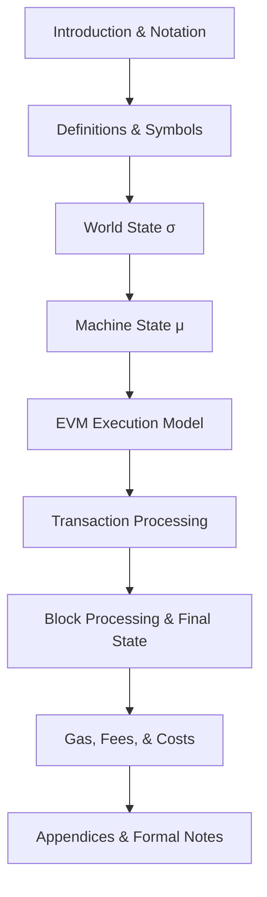
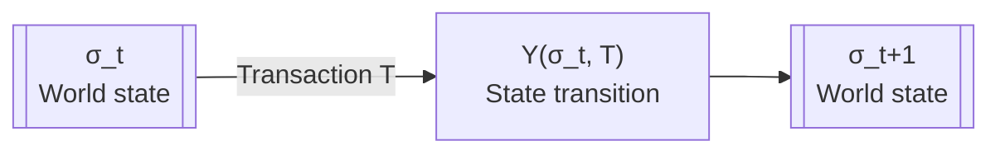
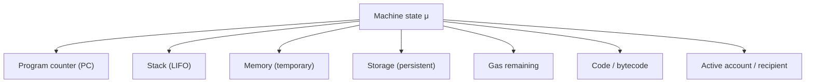
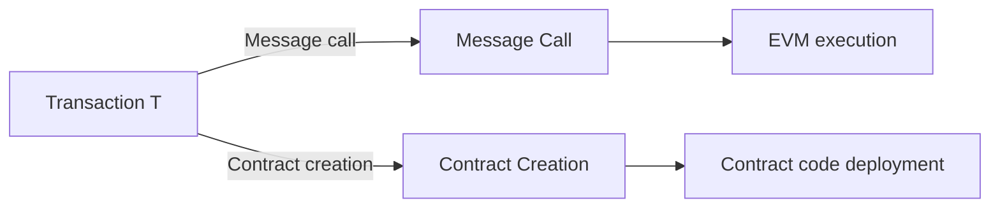
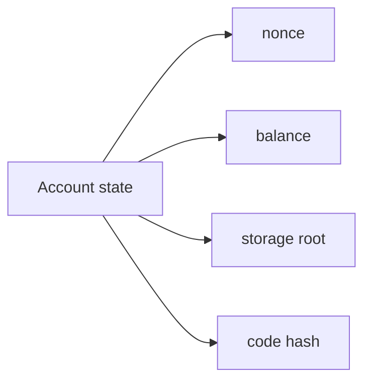
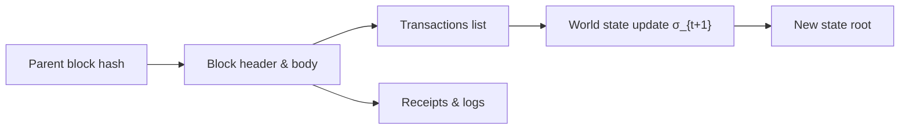
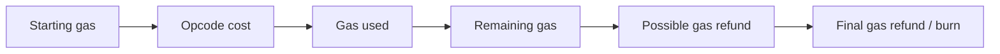

# Ethereum Yellow Paper Mermaid Reference

This file maps the core Ethereum Yellow Paper structure and EVM models into GitHub Mermaid diagrams.
It is a visual reference, not a verbatim reproduction. For the full formal specification, see:
https://ethereum.github.io/yellowpaper/paper.pdf

## 1. Yellow Paper structure map

## 2. State transition function

## 3. Machine state μ components

## 4. Transaction type classification

## 5. EVM execution lifecycle

## 6. Account state model

## 7. Block processing overview

## 8. Gas accounting summary

## 9. How to read this reference

- Use this file to map key Yellow Paper models into diagrams.
- Each Mermaid graph is a visual summary of core Yellow Paper concepts.
- For formal definitions, consult the official Yellow Paper directly.
