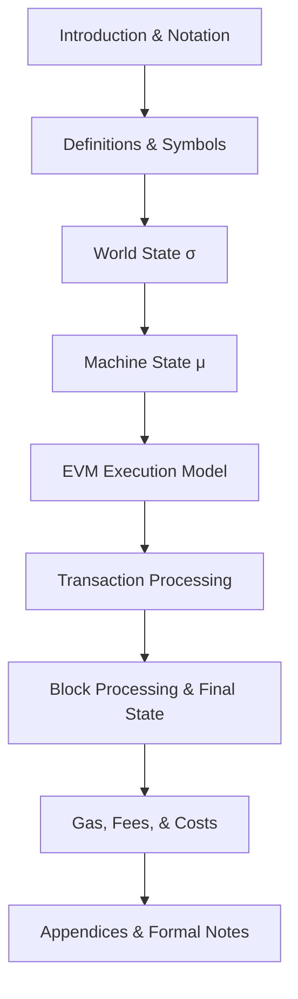
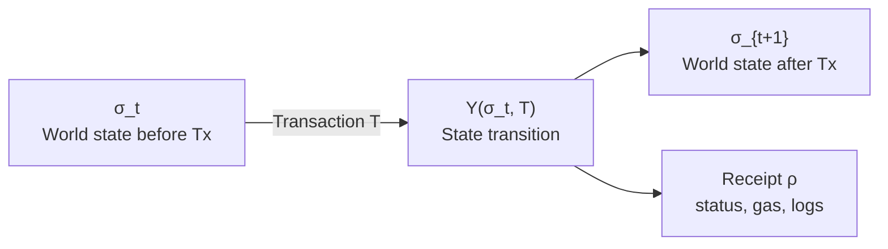
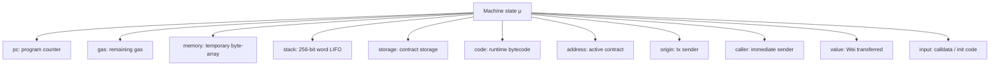
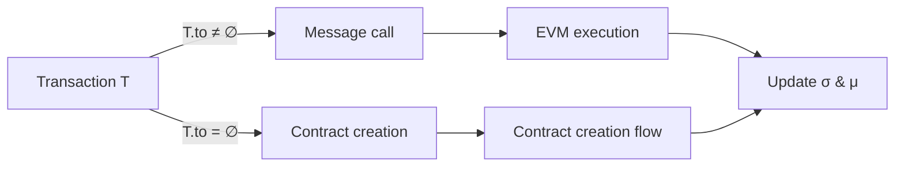
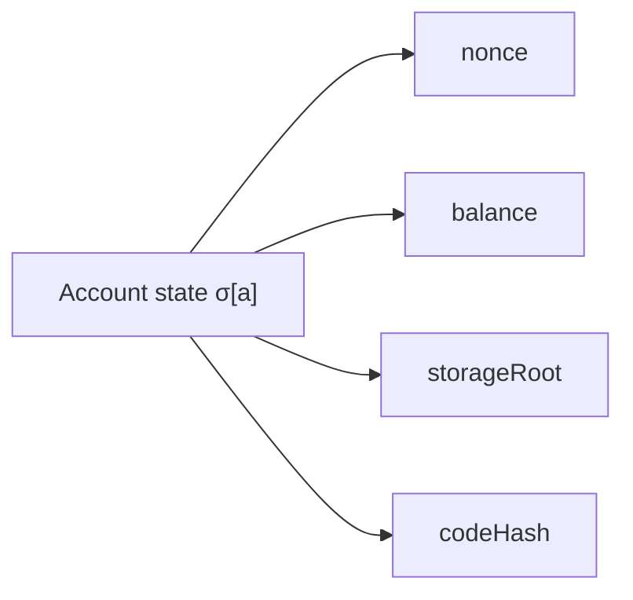
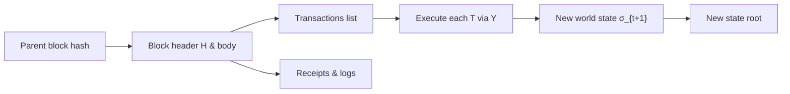

# Ethereum Yellow Paper Mermaid Reference

This file maps the core Ethereum Yellow Paper structure and EVM models into GitHub Mermaid diagrams.
It is a visual reference, not a verbatim reproduction. For the full formal specification, see:
https://ethereum.github.io/yellowpaper/paper.pdf

## 1. Yellow Paper structure map



## 2. Yellow Paper symbol reference table

### 2.1 World State and account components

| Symbol | Meaning | Section / formal context | Notes |
|---|---|---|---|
| `σ` | World state | Yellow Paper §4 / §5 | Global state mapping addresses to account state |
| `σ[a]` | Account state for address `a` | `σ[a] = (nonce, balance, storageRoot, codeHash)` | Each account has persistent storage and code reference |
| `A` | Account | World state entry key | Externally owned account or contract account |
| `nonce` | Transaction count | Part of account state | Prevents replay, increments on each tx/call |
| `balance` | Wei balance | Part of account state | Native Ether value held by account |
| `storageRoot` | Storage Merkle root | Part of account state | Root hash for contract storage trie |
| `codeHash` | Contract code hash | Part of account state | Hash of the account's runtime bytecode |
| `S` | Storage | `S = μ.storage` for active contract | Persistent key-value store for contract data |
| `z` | Zero value | State default value | Represents empty or uninitialized values |

### 2.2 Block and header components

| Symbol | Meaning | Section / formal context | Notes |
|---|---|---|---|
| `H` | Block header | Yellow Paper §4 / §11 | Contains metadata and roots for the block |
| `B` | Block | `B = (H, transactions, uncleHeaders)` | Full block with header and body |
| `parentHash` | Parent block hash | `H.parentHash` | Link to previous block in the chain |
| `ommersHash` | Ommer list hash | `H.ommersHash` | Hash of uncle block headers |
| `beneficiary` | Block reward address | `H.coinbase` | Account paid mining rewards and fees |
| `stateRoot` | World state root | `H.stateRoot` | Root hash of the trie after execution |
| `transactionsRoot` | Transaction trie root | `H.transactionsRoot` | Root of the block's transaction list |
| `receiptsRoot` | Receipt trie root | `H.receiptsRoot` | Root of transaction receipts |
| `logsBloom` | Bloom filter | `H.logsBloom` | Indexed log entries for light clients |
| `difficulty` | Mining difficulty | `H.difficulty` | Consensus difficulty target |
| `number` | Block number | `H.number` | Height of the block |
| `gasLimit` | Block gas limit | `H.gasLimit` | Maximum gas allowed for transactions in block |
| `gasUsed` | Gas used | `H.gasUsed` | Total gas consumed by block transactions |
| `timestamp` | Block timestamp | `H.timestamp` | Unix time for the block |
| `extraData` | Optional extra data | `H.extraData` | Miner-supplied metadata |
| `mixHash` | Proof-of-work mix hash | `H.mixHash` | Used in PoW validation |
| `nonce` | Block nonce | `H.nonce` | Used to prove work in PoW chain |

### 2.3 Transaction and call components

| Symbol | Meaning | Section / formal context | Notes |
|---|---|---|---|
| `T` | Transaction | Yellow Paper §4.3 | Transaction object applied to state |
| `nonce` | Transaction nonce | `T.nonce` | Sender's transaction count |
| `gasPrice` | Gas price | `T.gasPrice` | Wei per unit of gas paid by sender |
| `gasLimit` | Transaction gas limit | `T.gasLimit` | Max gas the tx may consume |
| `to` | Recipient address | `T.to` | Destination account or contract |
| `value` | Ether transferred | `T.value` | Amount of Wei sent with tx |
| `data` | Input data | `T.data` | Calldata for contract invocation |
| `v, r, s` | Signature values | `T.v`, `T.r`, `T.s` | Secp256k1 signature fields |
| `I` | Execution environment | Yellow Paper §4.3 | Includes `origin`, `caller`, `value`, `input`, `address`, `gasPrice`, `gasLimit`, `code` |
| `origin` | Transaction origin address | `I.origin` | Original sender of the transaction |
| `caller` | Immediate caller | `I.caller` | Current message sender in nested calls |
| `address` | Executing account | `I.address` | Account whose code is currently executing |
| `input` | Calldata / init code | `I.input` | Execution input bytes for calls or creation |
| `code` | Bytecode for execution | `I.code` | Runtime code used by the EVM |

### 2.4 Machine state and EVM components

| Symbol | Meaning | Section / formal context | Notes |
|---|---|---|---|
| `μ` | Machine state | Yellow Paper §9 | EVM execution context for current call |
| `pc` | Program counter | `μ.pc` | Index of next bytecode instruction |
| `gas` | Gas remaining | `μ.gas` | Fuel available for current execution |
| `memory` | Memory | `μ.memory` | Temporary byte-array buffer during execution |
| `stack` | Stack | `μ.stack` | LIFO stack of 256-bit words used by opcodes |
| `storage` | Storage | `μ.storage` | Current contract's persistent storage view |
| `code` | Bytecode | `μ.code` | Contract or init code the EVM executes |
| `activeContract` | Executing contract | `μ.address` | Address of contract currently running |
| `value` | Call value | `μ.value` | Wei sent with the current call |

### 2.5 State transition and function notation

| Symbol | Meaning | Section / formal context | Notes |
|---|---|---|---|
| `Υ` | State transition function | Yellow Paper §4.3 | `σ_{t+1} = Υ(σ_t, T)` applies tx to world state |
| `σ_{t+1}` | New world state | After transaction execution | Result state after transaction completion |
| `Δ` | State diff | Change from `σ_t` to `σ_{t+1}` | Used for receipts and state validation |
| `ρ` | Receipt | Transaction receipt | Records gas used, status, logs, state root |
| `z` | Zero value | Default storage/memory word | Used when reading uninitialized storage or memory |

## 3. Yellow Paper math and model explanation

The Yellow Paper defines Ethereum as a deterministic state machine. The main mathematical object is the state transition function:

```text
σ_{t+1} = Υ(σ_t, T)
```

- `σ_t` is the world state before the transaction.
- `T` is the transaction being processed.
- `Υ` computes the new world state after executing `T`.

The world state `σ` is a mapping from account addresses `a` to account state records:

```text
σ[a] = (nonce, balance, storageRoot, codeHash)
```

The machine state `μ` contains the EVM execution context:

```text
μ = (pc, gas, memory, stack, storage, code, address, origin, caller, value, input)
```

- `pc`: program counter within the code.
- `gas`: remaining gas for execution.
- `memory`: transient byte-addressable buffer.
- `stack`: last-in first-out stack used by opcodes.
- `storage`: contract storage visible to `SSTORE` / `SLOAD`.
- `code`: contract bytecode being executed.
- `address`: current executing account address.
- `origin`: original transaction sender.
- `caller`: immediate caller address.
- `value`: Wei sent with the call.
- `input`: calldata or init code for the current execution.

Gas accounting is expressed by subtracting instruction cost from remaining gas:

```text
g' = g - cost(opcode)
```

If the machine does not have enough gas, execution aborts with an out-of-gas condition.

The block header `H` contains fields used by state transition and gas calculations, for example:

```text
H = (parentHash, ommersHash, beneficiary, stateRoot, transactionsRoot, receiptsRoot,
     logsBloom, difficulty, number, gasLimit, gasUsed, timestamp, extraData, mixHash, nonce)
```

Transaction `T` fields include:

```text
T = (nonce, gasPrice, gasLimit, to, value, data, v, r, s)
```

The execution of `T` can be either a message call or contract creation. In both cases, the EVM uses `μ` and the environment `I` to step through opcodes and update `σ`.

## 4. State transition function

The core Yellow Paper equation is the state transition function:

```text
σ_{t+1} = Υ(σ_t, T)
```

- `σ_t` is the world state before the transaction.
- `T` is the transaction being executed.
- `Υ` is the state transition operator in Yellow Paper §4.3.

This operator includes:
- transaction validation
- gas deduction and balance updates
- execution of message call or contract creation
- receipt generation
- world state update

A higher-level description:

```text
Υ(σ, T) =
  if validTransaction(σ, T) then
    let (σ', ρ) := executeTransaction(σ, T)
    σ'
  else
    σ
```

Transaction receipts are produced by execution:

```text
ρ = (postStateRoot, cumulativeGasUsed, logsBloom, logs, status)
```



## 5. Machine state μ components

Yellow Paper §9 defines the EVM machine state `μ`:

```text
μ = (pc, gas, memory, stack, storage, code, address, origin, caller, value, input)
```

Component definitions:
- `pc`: program counter, current byte offset in code.
- `gas`: remaining gas for the current execution.
- `memory`: transient byte-array memory, expands on demand.
- `stack`: LIFO stack of 256-bit words, maximum depth 1024.
- `storage`: persistent contract storage state for current contract.
- `code`: current runtime bytecode executed by the EVM.
- `address`: address of the contract currently executing.
- `origin`: original transaction sender address.
- `caller`: immediate caller of the current message.
- `value`: Wei transferred with the current call.
- `input`: calldata or init code passed into execution.

Machine state updates follow these rules:

```text
pc' = pc + instructionSize(opcode)

g' = g - cost(opcode)

stack' = stackOp(opcode, stack)

memory' = memoryOp(opcode, memory)

storage' = storageOp(opcode, storage)
```

If `g' < 0`, the EVM throws an out-of-gas exception and execution reverts.



## 6. Transaction classification and execution

Transactions in Yellow Paper §4.3 are classified as either a message call or contract creation.

```text
T = (nonce, gasPrice, gasLimit, to, value, data, v, r, s)
```

- If `T.to` is non-empty, the transaction is a message call.
- If `T.to` is empty, the transaction is a contract creation.

Execution environment:

```text
I = (origin, caller, value, input, address, gasPrice, gasLimit, code)
```

Message call execution:

```text
σ' = executeMessageCall(σ, T)
```

Contract creation execution:

```text
σ' = createContract(σ, T)
```

The message call and creation share the same execution engine but differ in how `code`, `address`, and `storage` are initialized.



## 7. Account and contract state model

Yellow Paper §4 defines account state as:

```text
σ[a] = (nonce, balance, storageRoot, codeHash)
```

Account fields:
- `nonce`: transaction count for `a`.
- `balance`: Wei balance held by `a`.
- `storageRoot`: root hash of the contract storage trie.
- `codeHash`: Keccak-256 hash of the account's runtime code.

For contract accounts:

```text
codeHash = Keccak(code)
storageRoot = rootTrie(storage)
```

Balance transfer example:

```text
balance_{sender}' = balance_{sender} - value - gasUsed * gasPrice
balance_{recipient}' = balance_{recipient} + value
```



## 8. Block processing and final state

Yellow Paper §11 defines a block as:

```text
B = (H, transactions, uncleHeaders)
```

Block header `H` contains the execution roots:

```text
H = (parentHash, ommersHash, beneficiary, stateRoot, transactionsRoot, receiptsRoot,
     logsBloom, difficulty, number, gasLimit, gasUsed, timestamp, extraData, mixHash, nonce)
```

After processing all transactions in the block:

```text
stateRoot' = rootTrie(σ_{t+1})
receiptsRoot = rootTrie([ρ_1, ρ_2, ..., ρ_n])
logsBloom = bloom([logs_1, ..., logs_n])
```

Gas used by the block:

```text
gasUsed = Σ gasUsed(T_i)
```



## 9. Gas accounting summary

Yellow Paper §11 explains gas costs and refunds.

For each opcode:

```text
g' = g - cost(opcode)
```

If `g' < 0`, execution aborts with out-of-gas.

Transaction gas accounting:

```text
gasUsed(T) = gasLimit - gasRemaining
refundAmount = min(refundCounter, floor(gasUsed / 2))
```

Final gas settlement:

```text
refundValue = gasRemaining * gasPrice
```


## 10. How to read this reference

- Use this file to map key Yellow Paper models into diagrams.
- Each Mermaid graph is a visual summary of core Yellow Paper concepts.
- For formal definitions, consult the official Yellow Paper directly.
